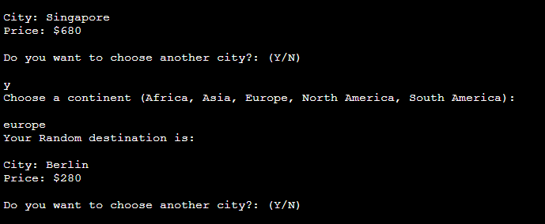

# The Random Destination Generator

The Random Destination Generator is an interactive text-based application, that will let the user travel plan in fun a creative way. The application
provides the user with a randomized city based on continent preference.

The live link can be found here - [The Random Destination Generator](https://random-destination-generator-3e9ef050a262.herokuapp.com/)

## Contents

- [Site Owner Goals](#site-owner-goals)
- [User Stories](#user-stories)
  - [First time user](#first-time-user)

- [Design](#design)
  - [Images](#images)
  - [Colours](#colours)
  - [Fonts](#fonts)
  - [Flowchart](#flowchart)

- [Features](#features)
  - [Features left to implement](#features-left-to-implement)

- [Technologies used](#technologies-used)

- [Languages](#languages)
- [Frameworks, Libraries and Programs](#frameworks-libraries-programs)
- [Modules](#modules)
- [Known bugs](#know-bugs)
- [Testing](#testing)

- [Validator Testing](#validator-testing)
  - [Accessibility](#accessibility)
- [Browser Testing](#browser-testing)
- [User Stories Testing](#user-stories-testing)
- [Friends and Family](#friends-and-family)
- [Deployment](#deployment)
  - [Heroku](#heroku)
  - [Github](#github)
- [Credits](#credits)
  - [Code](#code)
  - [Content](#content)
  - [Media](#media)
  - [Acknowledgements](#acknowledgements)

 ## Site Owner Goals

The Random Destination Generator is an application designed to simplify travel planning. To discover new travel destinations and to inspire spontaneus solo adventures or with a group of friends.

## User Stories
- ### First time user
  - As a first time user I want to understand the purpose of the application easily.
  - As a first time user I want a simple and intuitive interface for my travel inputs.
  - As a first time user I want clear instructions and guidance should I enter a wrongful input.
  - As a first time user I want the application to provide me with a random destination based on my preference.
  - As a first time user I want the option to add accommodation and transportation to help me plan my entire trip.
  - As a first time user I want the option to re-choose a city if that is not what I expected.
  - As a first time user I want the option to see the travel details displayed in a summary after I have made all my choices.
  - As a first time user I want the option to restart the application to make other choices, or to the exit the program.

- ### Returning User
  - As a returning user I can quickly make another choice so I can get another random destination generated wihout delay.
  - As a returning user I want to see my previous inputs so I can reuse input or avoid making the same input.

## Design

### Images
ASCII images are used to further enhance the purpose and to make the first look appealing to the user.

### Colours
The colours are imported from termcolor. Red colour is used when input is invalid for clarity to the user. The travel details summary is in yellow to add a contrast.

## Flowchart
The flowchart was produced via Lucid charts.

[Random Destination Flowchart](images/flowchart/random-destination-generator.png)

## Features

- ### The Landing Page
- Welcome text and image of airplane using ASCII

  

- Introductury text with instructions to proceed

  

- ### The Application
- User input for travel details on:
1. How many travelers are there. The user needs to type a number, starting from 1. Otherwhise invalid choice will display.

    

2. When do the user want to travel. The date format needs to be exactly the same and a future date. Otherwise invalid date in the right format will display.

    

3. How many days is the user planning on staying. The input needs to be a number, otherwise invalid choice will display.

    

4. The user can choose a continent from the continents listed. If the user type something rather than the contintens listed, invalid continent will display.

5. A random city and price will be presented based on users choice of continent. The data is retrieved from a google spreadsheet connected with API key.

    

6. The continents in the Google spreadsheet are each linked to a worksheet by continent name, where the citys along with the price are listed. When the user chooses a continent it will then randomize a city from the relevant worksheet.

    

7. An option to choose another city. The user needs to type y or n. If not invalid choice will display.

    

8. Question if the user wants to add accommodation. If yes, the user is presented with four options and selection is made by typing in a number between 1-4. If not, invalid choice will dispaly. If user chooses no next question will display.

    

9. Question if the user wants to add transportation. If yes, the user is presented with three options and selection is made by typing in a number betweeen 1-3. If not, invalid choice will display. If user chooses no, the travel summary will be displayed.

    

10. The travels details are then presentend in a table for the user. If the user didn't choose to add transportation or accomodation, it will not be included in the travel summary. If the user chooses another city, it will display the new random city in the summary.

    

11. The final step is to choose wether to start over or exit the program. If the user chooses to 1. Start over, the program will start all over. If the user chooses 2. Exit, the progam will clear the terminal and print a message.

    
    

### Features left to implement
  - Export the travel details to a pdf for the user to keep.
  - Extend the options for accommodation to actual names of hotels and hostels stored in the google spreadsheet.
  - Extend the options for transportation to car rental companies and different types of bus transfer stored in the google spreadsheet.

## Technologies used

## Languages
  - Python

  ## Frameworks, Libraries and Programs
   - [Gitpod](https://gitpod.io/) - Was the Codespace used for this project.
   - [Git](https://git-scm.com/) - Git was used for version control by using the Gitpod terminal to commit and then push to Github.
   - [Github](https://github.com/) - Is where the projects code is stored after being pushed.
   - [Heroku](https://www.heroku.com/auth/login) - The application was deployed to Heroku.

  ## Modules
  - Gspread was installed to open the spreadsheet that holds the random destination data.
  - Google.oauth2 module was installed to provide credentials.
  - Datetime module was installed to handle the date input from the user.
  - Termcolor was installed to change the text and image colour.
  - Tabulate module was installed to display the travel details in a table.
  - Random module was imported to randomize a city.
  - Os module was imported to interact with the operating system and exit the program.
  - Time module was installed to add delay before printing text using sleep function.

## Known bugs
No known bugs.

## Testing

### Validator Testing

 - ### Python
  - A lot of errors were returned when running the Python code through [PEP8](https://pep8ci.herokuapp.com/).
  The errors involved too long lines, whitespaces, trailing whitespaces and spaces. I resolve the trailing whitespace issue
  by enabling "Trim Trailing Whitespace" in file -> preferences -> settings, under the section file here in Gitpod. I also added a ruler in settings (settings.json)
  set to 78 to make sure that the lines I needed to correct wouldn't exceed that line. I worked my way
  to resolve all the errors. I ran the code through PEP8 again and no errors were returned.
    - [Python errors](images/pep8/error.PNG)
    - [Python all clear](images/pep8/all-clear.PNG)

 - ### Accessibility
  - The site achieved a Lighthouse accessibility score of 100%...
    - [Lighthouse result](assets/test-results/lighthouse-result.png)

### Application Testing
- The application was tested multiple times. All the input fields and logic has been tested properly to make sure that the user can't type other than valid input in the input fields. If the data is not valid, a relevant print message will be displayed to the user, which also have been tested properly.

### Browser Testing
 - The application was tested on Microsoft Edge, Google Chrome, Firefox and Safari browsers and no issues were noted.

### User Stories Testing
   #### First time user
1. As a first time user I understand the purpose of the application easily with the clear introductury messages and image.
2. As a first time user the interface for my travel inputs are intuitive with clear labeld input fields.
3. As a first time user I get clear instructions and guidance should I enter a wrongful input.
4. As a first time user I recieve a random destination along with the price, based on my continent input.
5. As a first time user I can choose to add accommodation and transportation, and to choose different accommodations and
 transportation options.
6. As a first time user I can re-choose a city if that is not what I expected or wanted.
7. As a first time user I can see the travel details displayed in a summary after I have made all my choices.
8. As a first time user I want the option to restart the application to make other choices, or to he exit the program.

   #### Returning user
1. As a returning user I can make another choice quickly so I can get another random destination generated wihout delay.
2. As a returning user I can see my previous inputs so I can reuse input or avoid making the same input.

  ## Friends and Family
   - Family members and friends were asked to test the website for bugs and overall experience.

## Deployment

## Heroku
The application was deployed to Heroku using the following steps:
1. Log in to Heroku
2. Create a new app
3. Navigate to settings
4. Navigate to Config Vars and add the following KEY/VALUE pairs:
    - CREDS and paste the data from the creds.json file (Only relevant if using google sheets)
5. Add buildpacks in the following order:
    - Python
    - nodejs
6. Allow Heroku to access Github and link the new app to your repository.
7. Choose between enabling Automatic deploys(the app will update automatically with every push to Github) or Manual Deploys.
8. Click on Deploy.

## Github
The project was deployed using Github pages with the following steps:
1. Go to the repository on Github.com.
2. Select 'Settings' towards the top of the page.
3. Select 'Pages' from the left menu bar.
4. Under 'Source', choose the preselected 'Branch' from the dropdown menu and then select the main branch.
5. Deployment is confirmed after a couple of minutes by the following message "Your site is published at" and there is a link to the web address.

The live link can be found here - [The Random Destination Generator](https://random-destination-generator-3e9ef050a262.herokuapp.com/)

## Credits

### Code
1. This guide was used for overall understanding of Python:
    - https://docs.python.org/3/library/
2. I used these guides to understand how to use datetime and how to validate the date and the date format:
    - https://www.datacamp.com/tutorial/converting-strings-datetime-objects
    - https://www.tutorialspoint.com/How-to-do-date-validation-in-Python
    - https://www.w3schools.com/python/python_datetime.asp
    - https://stackoverflow.com/questions/74091035/how-do-i-validate-a-date-format-with-python

3. With the help of the guides above and the following I could also understand how to get the weekday of the users input date:
    - https://pynative.com/python-get-the-day-of-week/

4. I used this code to get a random choice of a city generated to the user:
    - https://pynative.com/python-random-choice/

5. I used the steps and code from the Love Sandwich project to get the google spreadsheet connected. Additionally I used this guide:
   - https://data-flair.training/blogs/read-data-from-google-sheets-using-python/
  and some code from here:
    - https://aryanirani123.medium.com/read-and-write-data-in-google-sheets-using-python-and-the-google-sheets-api-6e206a242f20
    - https://www.jayasekara.blog/2021/07/accessing-google-spreadsheet-data-using-python.html?m=1

6. I used this guide to implement the correct exception for Gspread data:
    - https://docs.gspread.org/en/latest/api/exceptions.html

7. I used this guide to get the travel details table printed with reversed background and with bold text:
    - https://pypi.org/project/termcolor/0.2/
    - https://www.stechies.com/print-colored-text-python/

8. I used these guide on how to print a table using the tabulate module:
    - https://pypi.org/project/tabulate/
    - https://www.stechies.com/create-table-python/

9. I used this guide to understand how to append transportation and accommodation to travel details:
    - https://docs.python.org/3/tutorial/datastructures.html

10. I used my notes from the section "Reading Data from a file" and "Try and Except Statements" in the LMS to understand how to read the files in the main function.

11. I struggled a bit to get the updated city and price from the another_choice function. This helped me understand and fix the issue:
    - https://rollbar.com/blog/python-typeerror-nonetype-object-is-not-iterable/
    - https://stackoverflow.com/questions/75577437/typeerror-cannot-unpack-non-iterable-nonetype-object-not-sure-where-it-is-comi

### Content
The content were written by the developer.

### Media
   The background image was taken from:
 - [Unsplash](https://unsplash.com/photos/white-concrete-bridge-over-river-yQBaUS5L9OY)

  The airplane was taken from:
 - [Ascii art](https://asciiart.website/index.php?art=transportation/airplanes)

  The welcome text was generated here:
 -  [Text to Ascii art](https://patorjk.com/software/taag/#p=display&f=Doom&t=Destination%20Generator)

### Acknowledgements
- Antonio, my mentor, for guiding med throughout the project with important suggestions to improve the application and logic.
- To my husband and family, for all the support and patience throughout this project.

